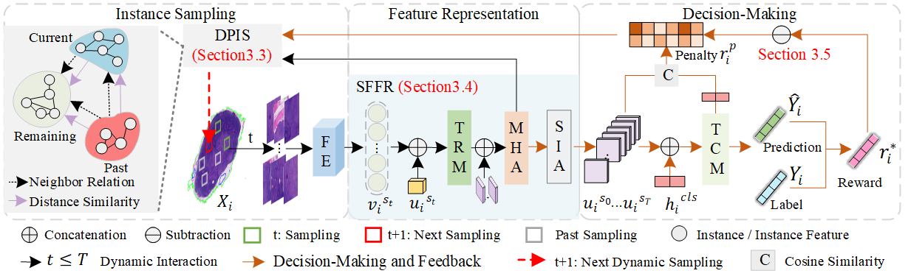

# Dynamic Policy-Driven Adaptive Multi-Instance Learning for Whole Slide Image Classification


[Tingting Zheng](https://scholar.google.com/citations?user=AJ5zl-wAAAAJ&hl=zh-CN),  [Kui jiang](https://scholar.google.com/citations?user=AbOLE9QAAAAJ&hl=en&oi=ao), [Hongxun Yao](https://scholar.google.com/citations?user=aOMFNFsAAAAJ)

[CVPR24]([https://arxiv.org/abs/2406.09696](https://openaccess.thecvf.com/content/CVPR2024/html/Zheng_Dynamic_Policy-Driven_Adaptive_Multi-Instance_Learning_for_Whole_Slide_Image_Classification_CVPR_2024_paper.html)) 



**Abstract:** Multi-Instance Learning (MIL) has shown impressive performance for histopathology whole slide image (WSI) analysis using bags or pseudo-bags. It involves instance sampling feature representation and decision-making. However, existing MIL-based technologies at least suffer from one or more of the following problems: 1) requiring high storage and intensive pre-processing for numerous instances (sampling); 2) potential over-fitting with limited knowledge to predict bag labels (feature representation); 3) pseudo-bag counts and prior biases affect model robustness and generalizability (decision-making). Inspired by clinical diagnostics using the past sampling instances can facilitate the final WSI analysis but it is barely explored in prior technologies. To break free of these limitations we integrate the dynamic instance sampling and reinforcement learning into a unified framework to improve the instance selection and feature aggregation forming a novel Dynamic Policy Instance Selection (DPIS) scheme for better and more credible decision-making. Specifically, the measurement of feature distance and reward function are employed to boost continuous instance sampling. To alleviate the over-fitting we explore the latent global relations among instances for more robust and discriminative feature representation while establishing reward and punishment mechanisms to correct biases in pseudo-bags using contrastive learning. These strategies form the final Dynamic Policy-Driven Adaptive Multi-Instance Learning (PAMIL) method for WSI tasks. Extensive experiments reveal that our PAMIL method outperforms the state-of-the-art by 3.8% on CAMELYON16 and 4.4% on TCGA lung cancer datasets.


## Update
- [2024/02/29] The repo is created
- [2024/07/27] Update preprocessing features

## Pre-requisites:
* Linux (Tested on Ubuntu 18.04)
* NVIDIA GPU (Tested on 3090)

## Dependencies:
```bash
torch
torchvision
numpy
h5py
scipy
scikit-learning
pandas
nystrom_attention
admin_torch
```

## Usage
  ### Dataset

   #### Preprocess TCGA Dataset

>We use the same configuration of data preprocessing as [DSMIL](https://github.com/binli123/dsmil-wsi).

   #### Preprocess CAMELYON16 Dataset

>We use [CLAM](https://github.com/mahmoodlab/CLAM/tree/master) to preprocess CAMELYON16 at 20x.
>For your own dataset, you can modify and run [create_patches_fp_Lung.py](https://github.com/titizheng/PAMIL/blob/main/slide_preproce/create_patches_fp_Lung.py) and [extract_features_fp_LungRes18Imag.py](https://github.com/titizheng/PAMIL/blob/main/slide_preproce/extract_features_fp_LungRes18Imag.py).


The data used for training, validation and testing are expected to be organized as follows:
```bash
DATA_ROOT_DIR/
    ├──DATASET_1_DATA_DIR/
        └── pt_files
                ├── slide_1.pt
                ├── slide_2.pt
                └── ...
        └── h5_files
                ├── slide_1.h5
                ├── slide_2.h5
                └── ...
    ├──DATASET_2_DATA_DIR/
        └── pt_files
                ├── slide_a.pt
                ├── slide_b.pt
                └── ...
        └── h5_files
                ├── slide_i.h5
                ├── slide_ii.h5
                └── ...
    └── ...
```


   #### Preprocessed feature vector

>We use preprocessing features from [MMIL](https://github.com/hustvl/MMIL-Transformer?tab=readme-ov-file). More details about this file can refer [DSMIL](https://github.com/binli123/dsmil-wsi) and [CLAM](https://github.com/mahmoodlab/CLAM/tree/master) Thanks to their wonderful works!

<div align="center">
  
| Dataset | Link | 
|------------|:-----|
| `TCGA`|[HF link](https://pan.quark.cn/s/e3d80653294d)
| `CAMELYON16-Testing`|[HF link](https://pan.quark.cn/s/0000a04c9895)
| `CAMELYON16-Training and validation`|[HF link](https://pan.quark.cn/s/0877b64faf78)
</div>


## Cite this work

```
@inproceedings{zheng2024dynamic,
    title={Dynamic Policy-Driven Adaptive Multi-Instance Learning for Whole Slide Image Classification},
    author={Zheng, Tingting and
            Jiang, Kui and
            Yao, Hongxun},
    booktitle={CVPR},
    year={2024}
}
```

